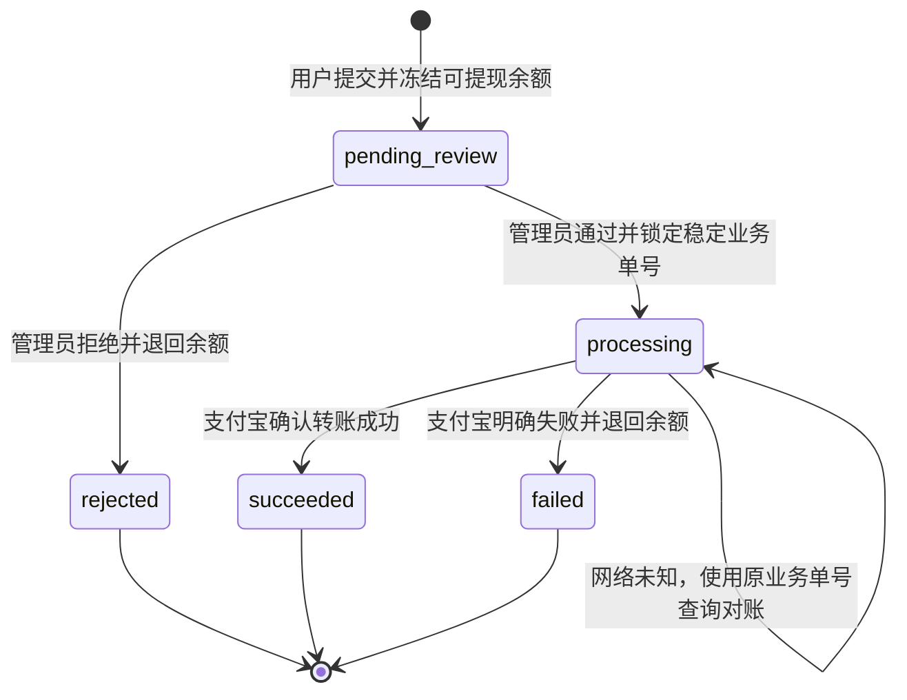

# Flutter 钱包重构与支付宝提现实现计划

> **执行对象：** 新会话中的 AI 代理。进入仓库后先阅读根目录 `AGENTS.md`，执行 CodeGraph 分析，并以本文档作为实施来源。实施过程中逐项勾选，保持本文档状态同步。未经用户再次确认，不执行真实数据库迁移、不写入真实支付宝证书、不发起真实转账、不提交或推送 Git。

**目标：** 将当前混合了收益与钱包流水的页面重构为完整的钱包功能：个人页展示钱包摘要；“我的钱包”承载可提现余额与入口；“钱包明细”展示全部资金流水；累计收益只统计二手交易卖家净收益；新增仅支持支付宝的提现申请、后台审核、转账、对账与通知闭环。

**现有技术栈：** Flutter/Dart、NestJS/TypeORM/MySQL、Vue 3/TypeScript/Element Plus、`alipay-sdk` 4.14.0。

---

## 1. 当前现状与已确认问题

### 1.1 Flutter 当前行为

- 个人页钱包卡片位于 `flutter_app/lib/features/profile/presentation/pages/profile_page.dart`，展示：
  - `available`：当前可用余额。
  - `pending`：当前 `pendingBalance`。
  - `total`：后端统计的累计收入。
- 卡片右上角写“查看明细”，点击后通过 `ProfileWalletDestination` 打开 `WalletPage`。
- `WalletPage` 标题是“我的收益”，但请求 `/shop/wallet/transactions` 时默认不传 `type`，实际展示收入、支出、冻结、解冻等全部钱包流水。
- 当前页面使用“全部、待审核、已到账、已拒绝”状态筛选，这适合收益结算审核，不适合作为完整钱包明细的主筛选。

### 1.2 后端当前行为

- 二手订单只有在订单完成且不存在进行中售后时，才创建卖家结算流水。
- 卖家净收益为 `订单成交金额 - 平台手续费`，先进入 `User.pendingBalance`。
- 结算流水状态为 `pending`；管理员可提前审核，满 7 天后定时任务自动通过。
- 审核通过后，金额从 `pendingBalance` 转入 `balance`。
- `/shop/wallet/stats` 的 `total` 当前汇总所有 `type=income` 且状态为 `pending/approved` 的流水，会错误包含余额退款、管理员加款等非二手销售收入。
- `/shop/wallet/transactions` 是完整钱包流水接口，本身的数据范围适合“钱包明细”。
- `RelatedType.WITHDRAW` 已存在，但目前只是枚举/展示占位；没有用户提现实体、接口、Flutter 页面或支付宝转账链路。
- 管理员减少余额目前也被记录为 `relatedType=withdraw`，未来必须和真实提现区分。

### 1.3 支付宝当前能力

- `server/src/payment/alipay.service.ts` 已封装支付宝支付、查询、关闭、退款，并使用现有 `alipay-sdk`。
- `PaymentModule` 已导出 `AlipayService`，`ShopModule` 已导入 `PaymentModule`，可在钱包提现服务中复用。
- 当前只初始化公钥模式：`ALIPAY_APP_ID`、`ALIPAY_PRIVATE_KEY`、`ALIPAY_PUBLIC_KEY`。
- 已安装 SDK 同时支持证书模式，但项目尚未配置应用公钥证书、支付宝公钥证书和支付宝根证书。

---

## 2. 锁定的产品口径

本计划按以下口径实施。新会话不得自行改变，若要改变必须先向用户说明影响并获得确认。

### 2.1 金额定义

| 名称 | 定义 | 是否可提现 | 数据来源 |
| --- | --- | --- | --- |
| 可提现余额 | 已经进入 `User.balance` 的全部可用资金 | 是 | `User.balance` |
| 待到账 | 二手订单完成后，尚未通过结算审核的卖家净收益 | 否 | `User.pendingBalance` |
| 提现中金额 | 已从可提现余额预占，等待审核或支付宝最终结果的金额 | 否 | 新增 `User.withdrawalFrozenBalance` |
| 累计二手收益 | 二手订单卖家净收入累计值，包含待到账和已到账，排除拒绝记录 | 不直接代表可提现金额 | 二手订单结算流水汇总 |

### 2.2 累计二手收益计算规则

必须同时满足：

- `wallet_transactions.userId = 当前用户`。
- `type = income`。
- `relatedType = order`。
- `status IN (pending, approved)`。
- 关联订单 `orderType = second_hand`。
- 关联订单 `sellerId = 当前用户`。
- 交易金额使用结算时已扣除平台手续费的 `sellerIncome`，不按订单原价重复计算。

必须排除：

- 余额退款。
- 管理员加款或补偿。
- 充值。
- 被拒绝的卖家结算。
- 提现退回、解冻等非销售收入。

消费和提现不会减少累计二手收益。

### 2.3 二手收益结算规则

- 保留当前规则：订单完成后创建待结算收入，管理员可提前审核，满 7 天自动通过。
- 后端字段和后台仍可使用“待审核”。
- Flutter 用户端统一显示“待到账”，避免暴露后台流程术语。
- 本计划不改变确认收货、售后范围、平台手续费和 7 天自动结算规则。

### 2.4 提现规则

- v1 只支持支付宝，不支持微信、银行卡或现金人工打款。
- 当前 `balance` 中的全部可用资金都可提现，包括已结算二手收益、余额退款和管理员加款。
- 所有提现都必须经过 `SUPER_ADMIN` 人工审核，不自动转账。
- 提现不收取用户手续费；申请金额等于支付宝到账金额。
- 默认最低提现金额 1 元；单笔上限和单日上限从系统配置读取，默认均为 50000 元。
- 单日限额按 `Asia/Shanghai` 自然日计算；累计当日 `pending_review`、`processing` 和 `succeeded` 提现金额，排除 `rejected` 和 `failed`。
- 同一用户同时只允许存在一笔 `pending_review` 或 `processing` 提现，避免并发审核和账户变更复杂化。
- 用户每次申请时填写支付宝账号和支付宝实名姓名；v1 不单独实现长期绑定支付宝账号。
- 提交后不可由用户撤销。管理员审核拒绝或支付宝明确失败时，资金自动退回可提现余额。
- 支付宝网络超时或结果不明确时，资金继续冻结，禁止直接退回或再次创建新转账；必须通过同一业务单号查询确认。

### 2.5 不在 v1 范围内

- 微信或银行卡提现。
- 用户提现手续费。
- 自动审核和自动打款。
- 用户自行取消提现。
- 支付密码、短信二次验证、实名认证/KYC 系统。
- 多个支付宝账号管理。
- 营销余额与现金余额拆分。
- 改变现有二手订单售后和 7 天结算政策。

管理员人工审核是 v1 的风险控制边界；正式扩大金额或取消人工审核前，必须另行补充二次验证与身份校验。

---

## 3. 目标信息架构与页面规划

```text
我的页面
└── 我的钱包摘要
    ├── 可提现余额
    ├── 待到账
    ├── 累计二手收益
    └── 点击整块进入“我的钱包”

我的钱包
├── 可提现余额
├── 提现按钮
├── 待到账
├── 累计二手收益
├── 钱包明细入口
└── 提现记录入口

钱包明细
├── 全部资金流水
├── 收入/支出筛选
├── 业务来源筛选
└── 订单或提现详情跳转

支付宝提现
├── 提现金额
├── 全部提现
├── 支付宝账号
├── 支付宝实名姓名
└── 确认申请

提现记录/详情
└── 审核中、转账中、已到账、已拒绝、转账失败
```

### 3.1 个人页钱包摘要

修改 `profile_page.dart`：

- 标题保持“我的钱包”。
- 右上角“查看明细”改为单独的右箭头或“进入钱包”，不能再暗示点击后直接进入流水页。
- 主金额标签明确为“可提现余额”。
- 两个次级字段改为“待到账”和“累计二手收益”。
- 整块钱包区域仍打开“我的钱包”。
- 返回个人页时重新刷新摘要，确保提现申请或结算后金额即时同步。

### 3.2 我的钱包页

将现有 `WalletPage` 重构为钱包首页：

- AppBar 标题为“我的钱包”。
- 第一视觉层展示可提现余额和明确的“提现”按钮。
- 次级展示“待到账”和“累计二手收益”。
- 提供“钱包明细”和“提现记录”两个列表入口。
- 提现能力未配置或关闭时，余额和明细仍正常可用；提现按钮禁用并显示服务不可用状态。
- 页面重新获得焦点或从子页面返回时刷新余额和最近状态。

### 3.3 钱包明细页

将当前交易列表移动到独立的 `wallet_transactions_page.dart`：

- AppBar 标题为“钱包明细”。
- 主筛选改为“全部、收入、支出”，冻结/解冻按金额方向归类。
- 增加业务来源菜单：二手交易、余额支付、退款、支付宝提现、公益捐款、平台调整。
- 状态使用业务语义：
  - 二手收入 `pending`：待到账。
  - 二手收入 `approved`：已到账。
  - 提现 `pending_review`：审核中。
  - 提现 `processing`：转账中。
  - 提现 `succeeded`：已到账。
  - 提现 `rejected`：已拒绝。
  - 提现 `failed`：转账失败，余额已退回。
- 金额方向：收入/解冻为 `+`，支出/冻结/提现为 `-`。
- 二手结算可打开卖家订单详情；真实提现可打开提现详情。
- 保留分页、下拉刷新、触底加载、空态、独立重试和未知枚举兼容。

### 3.4 支付宝提现页

- 展示当前可提现余额、最低金额、单笔上限和单日剩余额度。
- 金额输入只允许最多两位小数，提供“全部提现”。
- 输入“支付宝账号（手机号/邮箱）”和“支付宝实名姓名”。
- 提交前展示确认对话框，包含金额、脱敏账号和姓名。
- 防止重复点击；每次提交生成客户端幂等键并在本次请求重试中复用。
- 成功提交后打开提现详情或结果页，状态为“审核中”。
- 余额不足、存在处理中提现、超限、配置关闭等错误使用后端业务错误映射为明确提示。

### 3.5 提现记录和详情

- 提现记录按创建时间倒序分页。
- 列表展示金额、状态、脱敏支付宝账号和申请时间。
- 详情展示提现单号、金额、状态、脱敏账户、审核/完成时间、拒绝或失败原因。
- 不向客户端返回支付宝账号和实名姓名的明文密文。

---

## 4. 提现状态机与资金变化



### 4.1 用户提交提现

在单个数据库事务内：

1. 使用悲观锁读取用户。
2. 校验提现开关、金额、单日限额、可提现余额和活跃提现数量。单日限额按 `Asia/Shanghai` 自然日统计 `pending_review + processing + succeeded`，排除 `rejected + failed`。
3. `balance -= amount`。
4. `withdrawalFrozenBalance += amount`。
5. 创建 `wallet_withdrawals`，状态为 `pending_review`。
6. 创建一条 `wallet_transactions`：
   - `type=expense`。
   - `relatedType=withdraw`。
   - `relatedId=withdrawal.id`。
   - `status=pending`。
   - `balanceBefore/After` 记录申请时可用余额变化。
7. 提交事务后发送“提现申请已提交”通知，可选；通知失败不能回滚资金事务。

### 4.2 管理员拒绝

仅允许 `pending_review`：

1. 锁定提现单和用户。
2. `withdrawalFrozenBalance -= amount`。
3. `balance += amount`。
4. 提现单改为 `rejected`，写入管理员、时间和原因。
5. 关联钱包流水改为 `rejected`。
6. 写状态日志。
7. 提交事务后通知用户余额已退回。

### 4.3 管理员通过并发起支付宝转账

禁止在数据库事务内等待支付宝网络请求，采用三段式处理：

0. **配置前置检查**
   - 在进入 `processing` 前调用 `isTransferConfigured()`，确认支付宝转账参数、密钥/证书和业务开关完整可用。
   - 配置不完整时保持 `pending_review`，返回可操作的配置错误；不得让提现单卡在无法发起转账的 `processing`。
1. **准备阶段事务**
   - 锁定提现单。
   - 仅接受 `pending_review`。
   - 生成并永久保存唯一 `outBizNo`。
   - 状态改为 `processing`，记录审核管理员和时间。
2. **外部调用阶段**
   - 解密收款账号和姓名。
   - 使用 `outBizNo` 调用 `alipay.fund.trans.uni.transfer`。
   - 不记录账号、姓名、私钥、证书内容或完整支付宝响应。
3. **落库阶段事务**
   - 明确成功：`withdrawalFrozenBalance -= amount`，提现单改为 `succeeded`，钱包流水改为 `approved`，保存支付宝业务标识。
   - 明确失败：`withdrawalFrozenBalance -= amount`，`balance += amount`，提现单改为 `failed`，钱包流水改为 `rejected`。
   - 网络超时或响应无法判定：保持 `processing` 和冻结金额，只记录脱敏错误，等待查询对账。

### 4.4 对账与恢复

- 使用 `alipay.fund.trans.common.query` 按原 `outBizNo` 查询。
- 后台提供单笔“查询状态”操作，只允许 `processing`。
- 定时任务每 10 分钟扫描超过合理等待时间的 `processing` 记录并查询。
- 任何重试都不得生成新的 `outBizNo`。
- 查询明确成功/失败后复用同一套终态落库函数，保证人工查询、定时任务和首次转账返回行为一致。
- 支付宝已明确成功但本地终态事务提交失败时，提现单仍保持 `processing`；后续必须按原 `outBizNo` 查询并幂等补齐本地成功终态，禁止再次发起转账。
- 并发管理员点击、定时任务和人工查询必须通过版本字段和行锁保证只结算一次。

---

## 5. 后端数据模型

### 5.1 `users` 新字段

新增：

```text
withdrawalFrozenBalance DECIMAL(10,2) NOT NULL DEFAULT 0
```

含义只限“已提交但尚未进入提现终态的冻结资金”，不得复用 `pendingBalance`。

### 5.2 新增 `wallet_withdrawals`

建议字段：

| 字段 | 用途 |
| --- | --- |
| `id` | 主键 |
| `withdrawalNo` | 用户可见提现单号，唯一 |
| `idempotencyKey` | 客户端幂等键，与 `userId` 建联合唯一索引 |
| `userId` | 提现用户 |
| `walletTransactionId` | 关联钱包流水，唯一 |
| `amount` | 提现金额，DECIMAL(10,2) |
| `status` | `pending_review/processing/succeeded/rejected/failed` |
| `payeeIdentityType` | v1 固定 `ALIPAY_LOGON_ID` |
| `payeeAccountEncrypted` | AES-256-GCM 加密后的支付宝账号 |
| `payeeAccountMasked` | 供列表和响应展示的脱敏账号 |
| `payeeNameEncrypted` | 加密后的实名姓名 |
| `payeeNameMasked` | 脱敏姓名 |
| `encryptionKeyVersion` | 支持后续密钥轮换 |
| `outBizNo` | 支付宝业务单号，唯一，进入 processing 前生成 |
| `alipayOrderId` | 支付宝返回业务标识，可空 |
| `payFundOrderId` | 支付宝资金单号，可空 |
| `alipayStatus` | 最近一次归一化外部状态 |
| `failureCode` | 脱敏失败码 |
| `failureMessage` | 可向管理员展示的脱敏失败原因 |
| `reviewedBy/reviewedAt` | 审核人和审核时间 |
| `rejectReason` | 审核拒绝原因 |
| `processingAt/completedAt/failedAt` | 关键状态时间 |
| `version` | 乐观锁版本 |
| `createdAt/updatedAt` | 创建和更新时间 |

索引至少包含：

- `UNIQUE(withdrawalNo)`。
- `UNIQUE(userId, idempotencyKey)`。
- `UNIQUE(walletTransactionId)`。
- `UNIQUE(outBizNo)`，允许空值。
- `INDEX(userId, createdAt)`。
- `INDEX(status, updatedAt)`。

### 5.3 新增 `wallet_withdrawal_logs`

记录所有状态变化和外部查询动作：

- `withdrawalId`。
- `fromStatus/toStatus`。
- `action`。
- `actorType`：`user/admin/system`。
- `actorId`。
- `externalCode` 和脱敏说明。
- `createdAt`。

日志只允许追加，不允许业务代码更新或删除。

### 5.4 钱包关联类型修正

- 在 `RelatedType` 增加 `adjustment`。
- 未来管理员增加/减少余额统一使用 `relatedType=adjustment`，不再伪装成充值或提现。
- 历史 `recharge/withdraw` 流水没有关联 `wallet_withdrawals` 时，前端和后台显示为“平台余额调整”或“历史余额调整”，不能打开提现详情。
- 真实提现必须能通过 `relatedId` 找到 `wallet_withdrawals`。

### 5.5 数据迁移

创建幂等手动迁移脚本：

```text
server/migrations/add-wallet-withdrawals.ts
```

要求：

- 使用数据库迁移锁。
- 支持 `--dry-run`，只检查不修改。
- 添加 `users.withdrawalFrozenBalance`。
- 创建两个新表和所有索引。
- 安全扩展 `wallet_transactions.relatedType` 的 MySQL ENUM，保留现有全部值并加入 `adjustment`。
- 不改写无法可靠识别的历史流水。
- 执行前备份数据库；实际执行必须另行获得用户确认。
- `synchronize` 必须继续保持 `false`。

---

## 6. 后端 API 合同

所有接口继续使用 JWT。新增 DTO，禁止控制器接收 `any`；分页、状态、金额和字符串均由 `class-validator` 校验。

### 6.1 钱包摘要

保留端点：

```http
GET /shop/wallet/stats
```

为兼容已发布 Flutter 客户端，保留现有字段名：

```json
{
  "success": true,
  "data": {
    "available": 100.00,
    "pending": 20.00,
    "total": 260.00,
    "frozen": 30.00
  }
}
```

- `available`：可提现余额。
- `pending`：待到账二手收益。
- `total`：修正后的累计二手净收益。
- `frozen`：提现处理中金额。

### 6.2 钱包明细

保留并增强：

```http
GET /shop/wallet/transactions?page=1&limit=10&type=&status=&relatedType=
```

- 增加 `relatedType` 白名单筛选。
- 对真实提现流水批量附加 `withdrawalStatus` 和 `withdrawalNo`，避免 N+1 查询。
- 对二手结算继续附加当前用户相关商品/订单信息。
- 保持当前分页 envelope，避免无关协议改造。

### 6.3 提现配置

```http
GET /shop/wallet/withdrawals/config
```

返回：

```json
{
  "enabled": false,
  "availableBalance": 100.00,
  "minAmount": 1.00,
  "maxAmountPerRequest": 50000.00,
  "remainingDailyAmount": 50000.00,
  "hasActiveWithdrawal": false,
  "unavailableReason": "支付宝提现暂未配置"
}
```

`enabled` 必须同时满足：业务开关开启、支付宝转账配置完整、PII 加密密钥可用。

### 6.4 用户创建提现

```http
POST /shop/wallet/withdrawals
Idempotency-Key: <uuid>
Content-Type: application/json

{
  "amount": "100.00",
  "alipayAccount": "user@example.com",
  "payeeRealName": "张三"
}
```

- 金额使用十进制字符串接收，正则限制最多两位小数，服务内部统一转分计算。
- 请求头幂等键必填且必须是合法 UUID；同一用户重复提交同一键返回原提现单，不重复冻结。
- 支付宝账号和实名姓名必须设置明确长度上限，去除首尾空白，拒绝空字符串、换行和其他控制字符；不要在 DTO 或业务层用宽泛 `string` 直接放行。
- 响应只返回脱敏账号和姓名。

### 6.5 用户提现列表与详情

```http
GET /shop/wallet/withdrawals?page=1&limit=10&status=
GET /shop/wallet/withdrawals/:id
```

- 只能查询当前用户自己的提现。
- 不返回密文、完整支付宝响应或内部密钥版本。

### 6.6 后台提现管理

仅允许 `SUPER_ADMIN`：

```http
GET  /server-api/admin/wallet/withdrawals
GET  /server-api/admin/wallet/withdrawals/:id
POST /server-api/admin/wallet/withdrawals/:id/approve
POST /server-api/admin/wallet/withdrawals/:id/reject
POST /server-api/admin/wallet/withdrawals/:id/reconcile
GET  /server-api/admin/wallet/withdrawal-config
PUT  /server-api/admin/wallet/withdrawal-config
```

后台列表支持：提现单号、用户 ID/手机号、状态、日期范围筛选。

配置字段：

- `businessEnabled`，默认 `false`。
- `minAmount`，默认 `1.00`。
- `maxAmountPerRequest`，默认 `50000.00`。
- `maxAmountPerDay`，默认 `50000.00`。

系统配置使用 `system_configs` 的独立 key：`wallet_withdrawal`。密钥和证书绝不能写入数据库配置。

---

## 7. 支付宝服务端对接

### 7.1 复用与扩展范围

扩展 `server/src/payment/alipay.service.ts`，不新增支付 SDK 依赖：

- `isTransferConfigured()`：检查转账所需配置是否完整。
- `createTransfer(input)`：调用 `alipay.fund.trans.uni.transfer`。
- `queryTransfer(outBizNo)`：调用 `alipay.fund.trans.common.query`。
- 将支付宝原始结果归一化为：`success/failed/unknown`。

实施时必须以支付宝当时的官方开放平台文档核对以下内容，不凭旧示例猜测：

- 应用是否已开通“转账到支付宝账户”产品权限。
- `productCode`、`bizScene`、`payeeInfo.identityType` 的当前合法值。
- 登录账号和实名姓名的必填/校验规则。
- `transferSceneName` 必须与支付宝商家平台已申报的转账场景名称完全一致；本项目卖家货款提现采用 `业务结算`，其场景上报信息类型固定为 `结算款项名称`，内容为 `二手商品销售货款`。
- 单笔和单日平台限额。
- 查询接口返回的终态枚举。

### 7.2 证书模式

扩展支付宝初始化逻辑：

- 如果三个证书路径均配置，使用证书模式。
- 如果三个证书路径都未配置，继续允许现有公钥模式。
- 只配置一部分证书时直接报告配置错误，禁止静默降级。
- 证书和私钥只通过部署环境挂载，绝不提交到仓库。

在 `server/.env.example` 增加占位说明，实际修改该环境模板前按仓库规则获得用户确认：

```dotenv
ALIPAY_APP_CERT_PATH=
ALIPAY_PUBLIC_CERT_PATH=
ALIPAY_ROOT_CERT_PATH=
ALIPAY_TRANSFER_SCENE_NAME=
ALIPAY_TRANSFER_SCENE_REPORT_INFO_TYPE=
ALIPAY_TRANSFER_SCENE_REPORT_INFO_CONTENT=
WALLET_PII_ENCRYPTION_KEY=
```

证书缺失不阻塞代码、单元测试和非提现钱包功能；只会令移动端提现配置返回 `enabled=false`。完成代码后再由用户提供证书路径和支付宝产品权限。

### 7.3 敏感信息保护

- 新增小范围 AES-256-GCM 加密服务，密钥来自 `WALLET_PII_ENCRYPTION_KEY`。
- 每次加密使用随机 IV 和认证标签，密文包含格式版本。
- 日志、异常、通知、Flutter 响应和 Admin 列表只显示脱敏账号/姓名。
- 支付宝原始响应只保存必要业务标识、状态码和可公开错误信息。
- 不记录私钥、证书内容、签名串、完整收款账号或实名姓名。

---

## 8. 后端实施任务

### 任务 1：先用测试锁定收益统计口径

- [x] 在 `wallet.service.spec.ts` 增加统计用例。
- [x] 证明退款、管理员加款、普通订单、拒绝结算不会进入累计二手收益。
- [x] 证明二手卖家 `pending/approved` 净收入会累计，消费和提现不影响累计值。
- [x] 修改 `getIncomeStats`，使用参数化查询并关联二手订单与卖家。
- [x] 收紧现有卖家收益 `approveTransaction/rejectTransaction`：只允许处理 `type=income + relatedType=order + second_hand + 当前用户为卖家` 的结算流水，其他流水必须拒绝。
- [x] 收紧 `autoApproveExpiredTransactions`：除 `type=income` 外，同样限定为二手订单卖家结算，避免未来其他收入被自动审核。
- [x] 保留 `/shop/wallet/stats` 现有 `available/pending/total` 字段并新增 `frozen`。

### 任务 2：建立提现数据模型和迁移

- [x] 新增 `WalletWithdrawal`、`WalletWithdrawalLog` 实体和状态枚举。
- [x] 新增 `User.withdrawalFrozenBalance`。
- [x] 扩展 `RelatedType.ADJUSTMENT`。
- [x] 修改管理员余额调整，未来写入 `adjustment`。
- [x] 创建可重复执行、支持 dry-run 的迁移脚本。
- [x] 增加实体、索引和迁移静态检查。

### 任务 3：实现提现配置与敏感信息服务

- [x] 新增 `WalletWithdrawalConfigService`，读取/校验 `system_configs.wallet_withdrawal`。
- [x] 默认关闭业务开关，使用安全默认限额。
- [x] 新增加密、解密和脱敏服务及单元测试。
- [x] 缺少密钥时 fail closed，不影响应用其他模块启动。

### 任务 4：实现用户提现申请

- [x] 新增严格 DTO 和查询 DTO，替换钱包新接口中的 `any`；金额只接收最多两位小数的十进制字符串，幂等键校验 UUID，账号/姓名限制长度并拒绝控制字符。
- [x] 实现幂等键、单日限额、单活跃提现、余额检查和行锁；单日额度按 `Asia/Shanghai` 自然日统计 `pending_review + processing + succeeded`。
- [x] 在同一事务内冻结余额、创建提现单、流水和日志。
- [x] 实现当前用户的配置、列表和详情接口。
- [x] 确保任何响应不泄露支付宝明文。

### 任务 5：扩展支付宝转账适配器

- [x] 先写 mock SDK 测试覆盖成功、明确失败、网络未知和查询终态。
- [x] 增加证书模式完整性校验。
- [x] 实现单笔转账和查询方法。
- [x] 归一化返回值，钱包服务不直接依赖支付宝原始字段。
- [x] 保证现有支付、回调和退款测试不回归。
- [x] 将 `transferSceneName` 和 `transferSceneReportInfos` 纳入提现配置校验和转账请求，缺失时关闭提现并返回明确配置错误。

### 任务 6：实现后台审核与对账

- [x] 新增独立 `WalletWithdrawalService`，禁止复用卖家收益 `approveTransaction/rejectTransaction`。
- [x] 实现配置前置检查，以及准备、外部调用、终态落库三段式审核；配置不完整时保持 `pending_review`。
- [x] 实现拒绝和余额退回。
- [x] 实现人工 reconcile 和每 10 分钟定时对账。
- [x] 覆盖支付宝成功但本地终态事务失败的恢复路径，只用原 `outBizNo` 对账补齐，不重复转账。
- [x] 覆盖并发审核、重复查询和重复回调式结果处理。
- [x] 新增提现成功、拒绝、失败通知场景；通知发送放在资金事务之后。

### 任务 7：增强钱包流水

- [x] 增加 `relatedType` 查询 DTO 和白名单。
- [x] 批量附加真实提现状态，不产生 N+1。
- [x] 保留二手关联订单能力。
- [x] 对无提现实体的历史 `relatedType=withdraw` 标记为历史平台调整。

### 任务 8：更新后端 API 文档

- [x] 同步更新 `admin/API_DOCUMENT.md`。
- [x] 写清金额定义、统计边界、提现状态、幂等、错误码和权限。
- [x] 写清证书缺失时的关闭行为。
- [x] 写清真实转账前需要开通的支付宝产品权限。

---

## 9. Admin 实施任务

### 9.1 API 层

遵循仓库约定放在 `admin/src/api-new/`，每个新增 API 文件只导出一个函数，并从 index 汇总导出。所有调用使用现有 Axios 封装、`async/await` 和 `try-catch`。

建议目录：

```text
admin/src/api-new/wallet-withdrawals/
├── types.ts
├── getWalletWithdrawals.ts
├── getWalletWithdrawalDetail.ts
├── approveWalletWithdrawal.ts
├── rejectWalletWithdrawal.ts
├── reconcileWalletWithdrawal.ts
├── getWalletWithdrawalConfig.ts
├── updateWalletWithdrawalConfig.ts
└── index.ts
```

### 9.2 提现审核页

新增：

```text
admin/src/views/WalletWithdrawals/index.vue
```

要求：

- 路由放在“钱包管理”下，标题“支付宝提现”。
- 页面路由和后端接口仅 `SUPER_ADMIN` 可用。
- 表格支持单号、用户、状态和时间筛选。
- 展示申请金额、脱敏账号/姓名、状态、审核人、外部业务单号和时间。
- 审核通过前使用确认弹窗展示精确金额和脱敏收款信息，并提示该操作会发起真实转账。
- 拒绝必须填写原因。
- `processing` 只显示“查询状态”，不能再次“审核通过”。
- `succeeded/rejected/failed` 只读。
- 页面提供提现规则设置入口，但不展示或编辑任何证书、私钥和加密密钥。
- 所有 Element Plus 组件显式导入。
- CRUD Schema 隐藏列使用 `table: { hidden: true }`，自定义列使用 `table.slots.default`。

### 9.3 现有后台页面修正

- `WalletAudit` 继续只处理“收益结算审核”，查询固定限制 `type=income + relatedType=order`，避免未来误审提现。
- `WalletTransactions` 增加 `adjustment` 标签和真实提现详情入口。
- 菜单结构最终为：钱包流水、收益结算审核、支付宝提现。

---

## 10. Flutter 实施任务

### 10.1 Domain 与 Repository

- [x] 将 `WalletStats` 本地字段改为语义明确的 getter：可提现余额、待到账、累计二手收益、提现冻结；wire 层继续解析 `available/pending/total/frozen`。
- [x] 扩展 `WalletTransactionQuery` 支持 `relatedType`。
- [x] 为钱包流水解析 `withdrawalStatus/withdrawalNo`。
- [x] 新增提现配置、提现单、分页和状态模型。
- [x] 在 `WalletRepository` 或独立 `WalletWithdrawalRepository` 中实现配置、申请、记录和详情接口。
- [x] `POST` 提现请求携带稳定 `Idempotency-Key`。
- [x] 保持严格 JSON 解析，对未知枚举保留安全兜底。

### 10.2 Controller 拆分

当前 `WalletController` 同时加载统计和交易列表，应按页面拆分：

```text
wallet_controller.dart                 # 钱包首页摘要
wallet_transactions_controller.dart    # 钱包明细分页筛选
wallet_withdrawal_controller.dart       # 提现表单与提交
wallet_withdrawal_records_controller.dart # 提现记录分页
```

每个 Controller 覆盖并发请求代次、防重复提交、刷新、分页、独立错误和 dispose 后不通知。

### 10.3 页面文件

```text
flutter_app/lib/features/wallet/presentation/pages/
├── wallet_page.dart
├── wallet_transactions_page.dart
├── wallet_withdrawal_page.dart
├── wallet_withdrawal_records_page.dart
└── wallet_withdrawal_detail_page.dart
```

- [x] 重构钱包首页。
- [x] 将当前流水列表移入钱包明细页并重做筛选与文案。
- [x] 实现支付宝提现表单、确认状态和防重复提交。
- [x] 实现提现记录和详情状态。
- [x] 从提现或明细返回后刷新钱包首页。
- [x] 从钱包首页返回个人页后刷新个人页摘要。

### 10.4 导航与通知

- [x] 保持 `ProfileWalletDestination` 指向新的钱包首页。
- [x] 在 Profile 页面工厂中增加钱包明细、提现、提现记录和详情回调。
- [x] 通知页面路由新增 `MyWallet` 和 `WalletWithdrawalDetail`。
- [x] 保留旧通知路径 `MyIncome` 到新钱包首页的兼容映射。

### 10.5 响应式与可访问性

- [x] 使用现有 WP11 视口测试窄屏、大字体和长金额。
- [x] 固定金额区、按钮和筛选控件尺寸，动态内容不得引发布局跳动。
- [x] 金额、实名姓名和错误文案不得溢出或遮挡。
- [x] 提现按钮、全部提现、筛选和状态都有明确语义与可测试 key。

---

## 11. 测试计划

### 11.1 Server 单元与集成测试

必须覆盖：

- 收益统计只包含二手卖家净结算。
- `pending/approved/rejected` 对累计收益的影响正确。
- 提交提现时余额和冻结余额原子变化。
- 金额精度使用分计算，拒绝零、负数、三位小数、NaN 和超限。
- 非 UUID 幂等键、超长账号/姓名及含换行或控制字符的收款信息被 DTO 拒绝。
- 余额不足、已有活跃提现、单日超限被拒绝；单日统计按 `Asia/Shanghai` 自然日包含 `pending_review/processing/succeeded`，排除 `rejected/failed`。
- 相同幂等键返回同一提现，不重复扣款。
- 两个不同幂等键并发提交不能超额冻结。
- 非本人不能读取提现详情。
- 非 `SUPER_ADMIN` 不能审核提现。
- 管理员拒绝完整退回余额。
- 支付宝成功只扣减一次冻结余额。
- 支付宝明确失败完整退回余额。
- 支付宝超时保持 processing 和冻结资金。
- 支付宝配置不完整时审核通过操作失败，提现单仍为 pending_review。
- 支付宝成功但本地终态事务失败后，可由原 `outBizNo` 对账恢复且不会重复转账。
- reconcile 使用原 `outBizNo`，并发执行不会重复结算。
- 卖家人工审核和 7 天自动审核都只处理二手订单卖家结算，不会误处理其他 income 流水。
- PII 加密可解密、篡改密文会失败、响应和日志不含明文。
- 缺少证书/密钥时钱包读取正常，提现被安全关闭。
- 现有支付宝支付、回调、退款和二手结算测试无回归。

建议命令：

```bash
cd server
npm test -- --runInBand wallet.service.spec.ts
npm test -- --runInBand wallet-withdrawal.service.spec.ts
npm test -- --runInBand alipay.service.spec.ts
npm run build
```

### 11.2 Admin 验证

```bash
cd admin
pnpm ts:check
pnpm build:pro
```

浏览器验证：

- SUPER_ADMIN 可进入提现审核页，其他角色不可见且接口返回 403。
- 列表、筛选、分页、详情、确认、拒绝和查询状态可用。
- processing 状态没有重复转账按钮。
- 手机和桌面视口无重叠，控制台无未知组件和运行时错误。

### 11.3 Flutter 测试

新增或更新：

- `wallet_repository_contract_test.dart`。
- `wallet_controller_test.dart`。
- `wallet_page_test.dart`。
- `wallet_transactions_page_test.dart`。
- `wallet_withdrawal_controller_test.dart`。
- `wallet_withdrawal_page_test.dart`。
- `wallet_withdrawal_records_page_test.dart`。
- `profile_page_test.dart`。
- `profile_navigation_test.dart`。
- `notification_navigation_targets_test.dart`。

验证命令：

```bash
cd flutter_app
dart format --output=none --set-exit-if-changed lib test
flutter analyze
flutter test test/wallet_repository_contract_test.dart
flutter test test/wallet_controller_test.dart
flutter test test/wallet_page_test.dart
flutter test test/profile_page_test.dart
flutter test test/profile_navigation_test.dart
flutter test
```

### 11.4 手工资金闭环验收

使用测试环境和小额测试账号：

1. 完成一笔二手订单，确认净收入进入“待到账”，累计二手收益增加。
2. 审核结算，确认待到账减少、可提现余额增加、累计二手收益不变。
3. 提交提现，确认可提现余额减少、提现中金额增加、钱包明细出现审核中提现。
4. 后台拒绝，确认余额完整退回且流水为已拒绝。
5. 再提交一笔并审核通过，确认支付宝到账、冻结金额清零、流水为已到账。
6. 模拟支付宝网络未知，确认不退余额、不重复转账，随后通过查询对账进入唯一终态。
7. 余额退款、管理员加款和公益捐款均出现在钱包明细，但不改变累计二手收益。

---

## 12. 发布顺序与证书补充

### 阶段 A：代码和数据库准备

- [x] 完成全部代码和 mock 测试。
- [x] 创建迁移脚本但不直接执行生产迁移。
- [x] 提现业务开关默认关闭。
- [x] 后端在没有证书时仍可正常启动。

### 阶段 B：部署关闭状态

- [x] 备份数据库并获得用户确认。
- [x] 先 dry-run，再执行迁移。
- [ ] 部署 Server、Admin 和 Flutter，保持提现开关关闭。
- [ ] 验证钱包摘要、累计收益和钱包明细。

### 阶段 C：用户补充支付宝能力

由用户提供或确认：

- 支付宝应用已开通“转账到支付宝账户”相关产品权限。
- `ALIPAY_APP_ID`。
- `ALIPAY_PRIVATE_KEY`。
- 公钥模式所需支付宝公钥，或证书模式的三个证书文件路径。
- 已在支付宝商家平台申报的转账场景名称；本项目应申报 `业务结算`，并配置 `ALIPAY_TRANSFER_SCENE_NAME=业务结算`、`ALIPAY_TRANSFER_SCENE_REPORT_INFO_TYPE=结算款项名称`、`ALIPAY_TRANSFER_SCENE_REPORT_INFO_CONTENT=二手商品销售货款`。
- 生产 `WALLET_PII_ENCRYPTION_KEY`。
- 单笔和单日业务限额。

不得把上述真实材料写入仓库。

### 阶段 D：小额验证和开放

- [ ] 在支付宝沙箱或允许的测试环境先验证接口权限。
- [ ] 使用最小金额做一笔人工审核转账。
- [ ] 核对支付宝账单、提现单、钱包流水和三类余额。
- [ ] 验证失败和查询路径。
- [ ] 最后由 SUPER_ADMIN 打开提现业务开关。
- [ ] 上线初期每日核对 processing 提现和冻结余额总额。

---

## 13. 最终验收标准

- 个人页不会再把钱包入口称为收益明细。
- 可提现余额、待到账、提现中金额和累计二手收益语义独立。
- 累计收益只包含二手平台卖货净收入。
- 钱包明细覆盖全部真实钱包变化，并能区分业务来源。
- 用户可提交支付宝提现并查看记录/详情。
- 提现申请、拒绝、成功、明确失败和网络未知路径均不会造成重复扣款、重复打款或资金凭空增减。
- 管理员收益结算审核和支付宝提现审核完全隔离。
- 只有 SUPER_ADMIN 可以触发真实支付宝转账。
- 支付宝账号、实名姓名、密钥和证书不会出现在日志或非必要响应中。
- 缺少证书时系统可正常运行，提现明确关闭。
- Server 构建与定向测试、Admin 类型检查与构建、Flutter analyze 与测试全部通过。
- `admin/API_DOCUMENT.md` 与最终接口完全一致。

---

## 14. 新会话启动提示

新会话可直接使用：

```text
请阅读并执行 docs/superpowers/plans/2026-07-30-wallet-alipay-withdrawal.md。
先按 AGENTS.md 使用 CodeGraph 核对索引和影响范围，然后逐项实施并同步勾选计划。
当前工作区可能有用户未提交改动，必须保留并避开无关修改。
先完成 mock/单元测试和代码实现；未经我再次确认，不执行真实数据库迁移、不写入支付宝证书、不发起真实转账、不提交或推送 Git。
证书缺失不作为代码实现阻塞，完成后列出我需要补充的支付宝配置和验证步骤。
```
